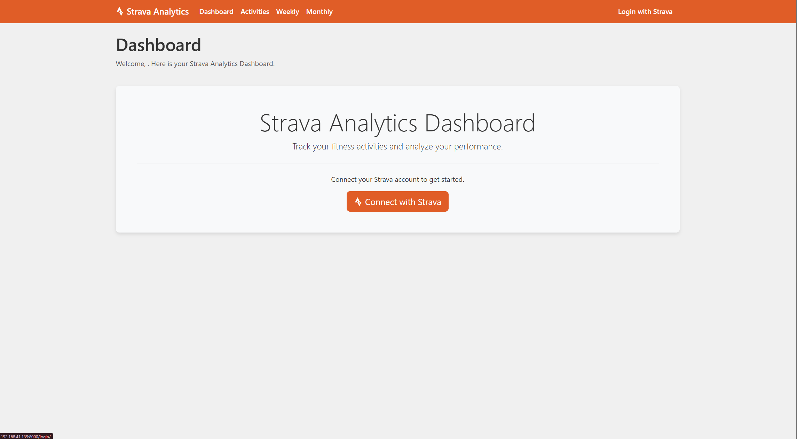

# Panel de Análisis de Strava

Una aplicación web local completa para rastrear y analizar tus datos de actividad de Strava con actualizaciones automáticas diarias.




## Funcionalidades


### Vistas del Panel
- Resúmenes de actividad **Diarios, Semanales, Mensuales**
- **Seguimiento de progreso** con conteo de actividades, distancia, desnivel acumulado y tiempo
- **Seguimiento de rachas** que muestra días consecutivos y días activos totales
- **Seguimiento de objetivos** para metas de distancia semanal
- **Gráficos interactivos** con capacidades de comparación semanal/mensual
- **Vista de calendario mensual** que muestra el estado de actividad diaria
- **Análisis de Esfuerzo Relativo**
- **Informes de resumen mensual**

### Gestión de Actividades
- Lista de actividades filtrable
- Registros de actividad individual que muestran:
  - Nombre de la actividad
  - Hora de finalización
  - Distancia y desnivel
  - Mapas de ruta
  - Comparaciones interanuales

## Implementación Técnica

### Flujo de Datos
- Script de Python que utiliza la API de Strava v3
- Tarea programada diaria (cron job) para actualizaciones automáticas de datos
- Esquema de base de datos con tablas para:
  - Activities (Actividades)
  - Athlete (Atleta)
  - Club (Club)
  - Equipment (Equipamiento)
  - Routes (Rutas)
  - Segment (Segmento)
  - Stream (Streams)
  - Load (Carga)

### Instrucciones de Configuración

1. **Clonar el repositorio**
   ```bash
   git clone https://github.com/hectorflores28/django-strava-analytics-dashboard
   cd django-strava-analytics-dashboard
   ```

2. **Instalar dependencias**
   ```bash
   pip install -r requirements.txt
   ```

3. **Configurar credenciales de la API de Strava**
   - Registra una aplicación en [Strava API Settings](https://www.strava.com/settings/api)
   - Actualiza `config.py` con tu ID de cliente y secreto

4. **Inicializar la base de datos**
   ```bash
   python init_db.py
   ```

5. **Configurar la tarea programada (cron job) para actualizaciones diarias**
   ```bash
   # Añadir al crontab (crontab -e)
   0 2 * * * cd /path/to/django-strava-analytics-dashboard && python daily_update.py
   ```

6. **Ejecutar la aplicación web**
   ```bash
   python app.py
   ```

### Variables de entorno (.env)
```
STRAVA_CLIENT_ID=tu_strava_client_id
STRAVA_CLIENT_SECRET=tu_strava_client_secret
SECRET_KEY=tu_secret_key
```

### Estructura del Proyecto
```
django-strava-analytics-dashboard/
├── StravaAPIv3.md          # Documentación de referencia de la API
├── config.py               # Configuración
├── daily_update.py         # Script de actualización diaria de datos
├── init_db.py              # Inicialización de la base de datos
├── app.py                  # Aplicación web
├── models.py               # Modelos de base de datos
├── requirements.txt        # Dependencias de Python
└── templates/              # Plantillas web
    ├── index.html          # Panel principal
    ├── activities.html     # Lista de actividades
    └── monthly.html        # Vista mensual
```

## Referencia de la API
Consulta la [Documentación StravaAPIv3](public/strava_api_v3_documentation.md) en el directorio raíz para obtener la documentación completa de la API de Strava v3 y detalles de los endpoints.

## Desarrollo
Este proyecto utiliza:
- Python 3.8+
- Framework web django
- Base de datos SQLite (puede configurarse para otras bases de datos)
- API de Strava v3 con autenticación OAuth2

## Soporte
Para problemas y preguntas, consulta:
- Documentación de la API de Strava: https://developers.strava.com/docs/reference/
- Página de issues del proyecto

---

*Este proyecto no está afiliado con Strava, Inc. pero utiliza su API de acuerdo con sus términos de servicio.*